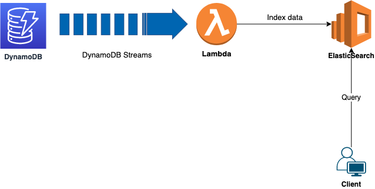

# Index DynamoDB data to elasticsearch

### What is this?
A serverless application that sets up a lambda function to consume data from a DynamoDB Stream and save it to an Elasticsearch cluster

### The Architecture
* A lambda function is responsible for consuming records from DynamoDB Streams and replicating it into Elasticsearch. 
* Python is used as lambda function language
* Serverless framework is used to build and deploy the services to AWS




### Tech Stack
* [Serverless Framework](https://www.serverless.com/)
* [Serverless Python Requirements](https://github.com/UnitedIncome/serverless-python-requirements#readme)
* [Amazon DynamoDB](https://aws.amazon.com/dynamodb/)
* [AWS Lambda](https://aws.amazon.com/lambda/)
* [Amazon Elasticsearch](https://aws.amazon.com/elasticsearch-service/)


### Prerequisite
* [Serverless framework](https://www.serverless.com/framework/docs/providers/aws/guide/installation/)
* [Python](https://wiki.python.org/moin/BeginnersGuide/Download)


### How to run it
```
npm install
```
```
sls deploy
```

### Author: Raisel Melian
* [Twitter](https://twitter.com/raiselmelian)